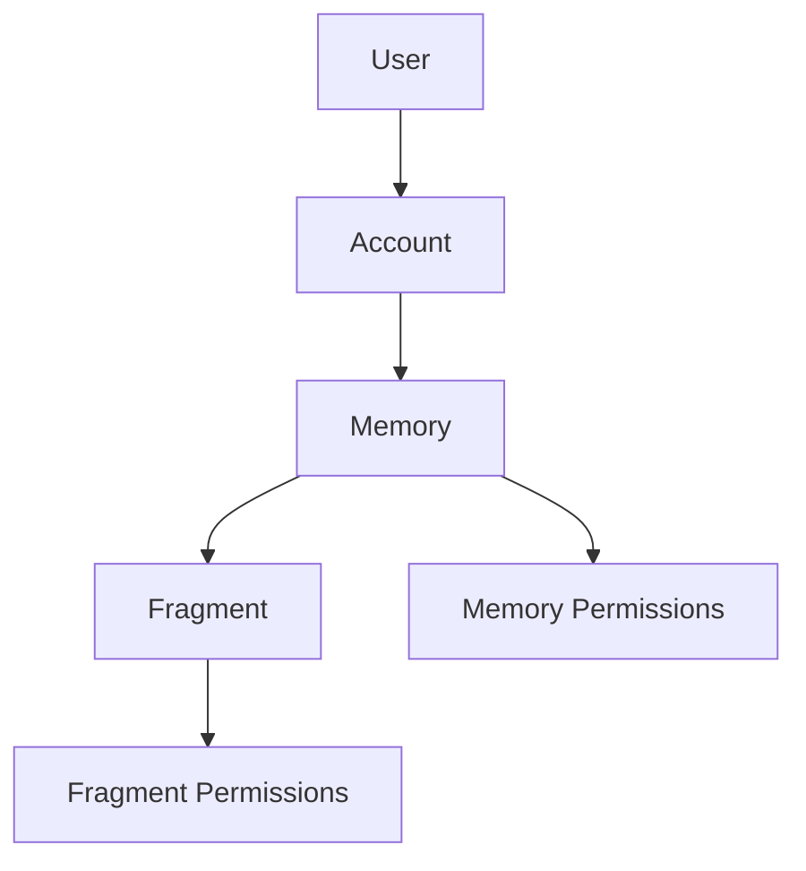

## Memory Permissions

- the creator of the memory always has *all* permissions, and they are the *owner* of the memory
- each memory has a set of allowed readers (user ids, or *all* if public)
- if a memory is public, anyone can read it
- if a memory is private, only the allowed readers can read it
- each memory has a set of allowed editors (user ids, or *all* can be configured so anyone can edit)

- i want to be able to navigate using the url to any memory that I have access to
- if i don't have access, it should show me back to the home page (depending on whether I'm logged in or not)

