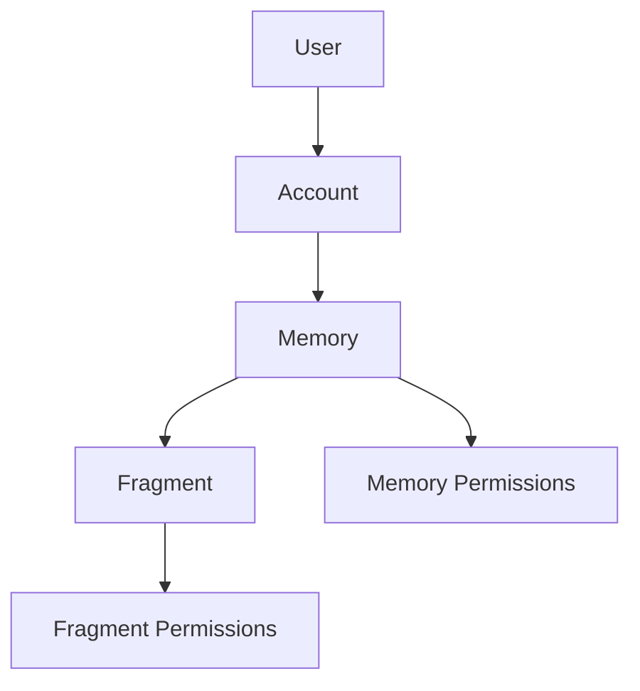

A place where to upload memories, achievements, interests and other things that are important to me.

I upload what I call a *Fragment*. Which is some form of media.

The forms of media are:

- Text
- RichText
- File
  - Audio
  - Image
  - Video (TODO)
  - Other (PDF, etc.)

These fragments make up a *Memory*.

## Fragment

A Fragment is a single piece of media. Each fragment has a type and a unique url. The url is used to interact with the media either by viewing or downloading.

- *Fragments* make up a *Memory*.
- A *Memory* can be merged with another *Memory*. In which case, the fragments that make up those two *Memories* are merged into a single *Memory*.

### File Fragment

A file fragment is ostensibly a file. It can be an image, audio, video or other type of file.
A FileFragment represents a file. It has a name.
A FileFragment can be uploaded to make up part of a *Memory*.
The upload of a FileFragment progresses in the background.
If the upload fails, then the FileFragment upload status is ERROR.
If the upload succeeds, then the FileFragment upload status is UPLOADED.

### Text Fragment

A Text Fragment represents textual content.
A Text Fragment can be saved to make up part of a *Memory*.

## Memory

A Memory is a collection of Fragments.

## Merging and splitting *Memories*

A *Memory* can be merged with another. This simply means the fragments that make up those two *Memories* are merged into a single *Memory*.

Two *Memories* can be merged. The fragments of both *Memories* are merged into a single *Memory*.
A *Memory* can be split. Fragments are selected to be split, and are moved to a new *Memory*.
A *Memory* can be shattered. This means that each fragment that makes up the *Memory* is split into its own *Memory*.

## Memory Permissions

- the creator of the memory always has *all* permissions, and they are the *owner* of the memory
- each memory has a set of allowed readers (user ids, or *all* if public)
- if a memory is public, anyone can read it
- if a memory is private, only the allowed readers can read it
- each memory has a set of allowed editors (user ids, or *all* can be configured so anyone can edit)

to start:

- if a memory is public, anyone can read it (DONE)
- 
## endpoints

/<user_name>/<memory_id>?editing=(true|false)
/auth/login
/share/<base64_encoded_info>

/<memory_id>?editing=(true|false)
/auth/login

- i want to be able to navigate using the url to any memory that I have access to
- if i don't have access, it should show me back to the home page (depending on whether I'm logged in or not)

## TODO

- ~~mark memory as draft~~
- ~~pin memories~~
- ~~memory tags~~

