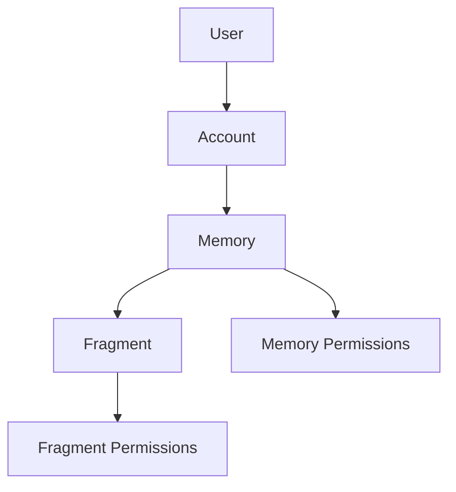

## Memory Permissions

- the creator of the memory always has *all* permissions, and they are the *owner* of the memory
- each memory has a set of allowed readers (user ids, or *all* if public)
- if a memory is public, anyone can read it
- if a memory is private, only the allowed readers can read it
- each memory has a set of allowed editors (user ids, or *all* can be configured so anyone can edit)

- i want to be able to navigate using the url to any memory that I have access to
- if i don't have access, it should show me back to the home page (depending on whether I'm logged in or not)

## API

- create memory
- list simple memories
- get memory
- delete memory
- pin memory
- tag memory
- set fragment ordering
- set memory title

- add file fragment
- add text/rich text fragment
- add rss fragment
- modify text fragment
- modify rss fragment
- delete fragment

- get memory
- list user/account memories
- delete memory
- pin memory
- tag memory
- set fragment ordering of memory
- set memory title
- add fragment
- modify fragment
- delete fragment

## other sharing stuff

- pinning a memory should only pin it for that user
- exporting memories/fragments as markdown? how do we deal with different media?